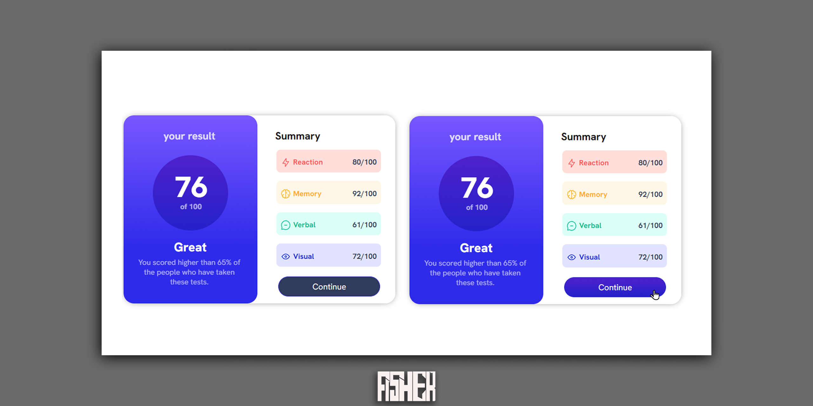

# Frontend Mentor - nft preview card component main

This is a solution to the [results summary component main](https://www.frontendmentor.io/challenges/nft-preview-card-component-SbdUL_w0U). Frontend Mentor challenges help you improve your coding skills by building realistic projects.

## Table of contents

- [Overview](#overview)
- [The challenge](#the-challenge)
- [Screenshot](#screenshot)
- [Links](#links)
- [Built with](#built-with)
- [Author](#author)

## Overview

### The challenge

Users should be able to:

- View the optimal layout for the site depending on their device's screen size

### Screenshot

### Links

- Solution URL: [click to see solution page](https://www.frontendmentor.io/solutions/results-summary-component-main-solved-with-htmlcss-w-IK0W6TYl)
- Live Site URL: [click to see live site](https://fishershadow.github.io/results-summary-component-main/)

### Built with

- Semantic HTML5 markup
- CSS custom properties
- Adobe Illustrator
- Adobe Photoshop

## Author

- Frontend Mentor - [@FisherSHADOW](https://www.frontendmentor.io/profile/FisherSHADOW)
